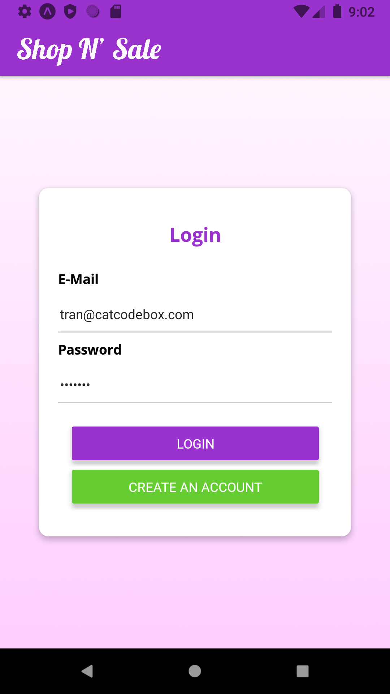

A simple shopping mobile application for iOS/Android developed with React Native/JavaScript that allows you to buy and sell items with ease. All users' information are stored on Firebase database (orders, products, userId...) and are fetched when signed in. 

- User can create an account and login to the app.
- User can create your own listing and sell your items.
- User can order items from other users on the app.

#

To run the project:

1. Install expo
2. Clone this repo
3. Run `npm install`
4. Run `npm start`

<h3>Home Screen:</h3>
All products from all users are displayed at the home screen.

(Android Version)

<h3>Log In Screen:</h3>

All users' credentials are stored on Firebase database.

<h3>Order Screen:</h3>

When ordered, items from cart will be save and display on the order screen.

<h3>User/Admin Screen:</h3>

User can create their own listing here and post what they want to sell.

